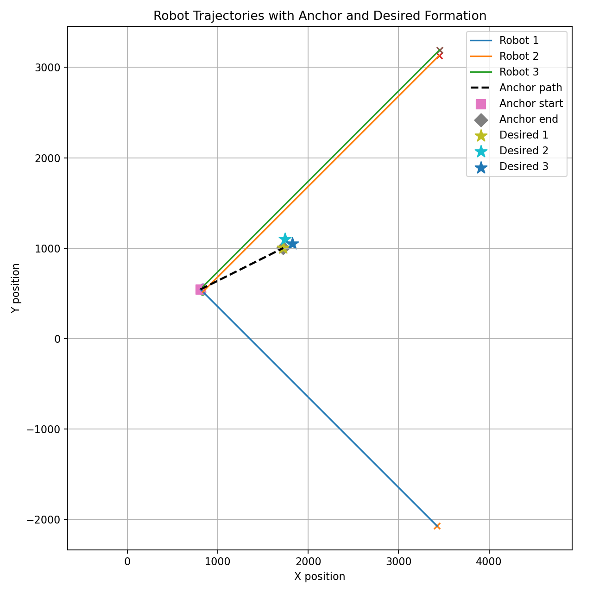

# Reinforcement Learning for Multi-Robot Formation Control

This project explores reinforcement learning methods for multi-robot formation control. The goal is to investigate whether model-free RL policies can learn stable formation behavior for multiple robots under a desired formation trajectory, and to compare direct-action RL methods with more structured controller-based approaches.

## Project Overview

The system consists of multiple robots modeled with simplified double-integrator dynamics:

```text
state_i = [x_i, vx_i, y_i, vy_i]
action_i = [u_xi, u_yi]
```

The robots are expected to maintain a desired formation defined by formation offsets while following a reference anchor moving at constant velocity.

The desired state for each robot is defined as:

```text
desired_state_i = [
    anchor_x + offset_xi,
    anchor_vx,
    anchor_y + offset_yi,
    anchor_vy
]
```

The formation error is computed using a graph Laplacian-based structure inspired by classical multi-agent formation control.

## Motivation

Classical formation controllers often use structured control laws such as:

```text
u = Γ L(q - h)
```

where:

- `q` is the stacked robot state
- `h` is the desired formation offset
- `L` is the graph Laplacian
- `Γ` is a controller gain matrix

This project first tests whether direct RL can learn the full control policy:

```text
u = π(obs)
```

Then, based on the limitations of direct policy learning, the next phase investigates structured RL approaches where learning is used to tune controller parameters such as `Γ`.

## Methods Tested

### Direct-Action RL Baselines

The following direct-action RL algorithms were tested:

- SAC
- PPO
- DDPG

In these baselines, the policy directly outputs the acceleration commands for all robots:

```text
action = [u_x1, u_y1, u_x2, u_y2, u_x3, u_y3]
```

### Reward Design

The reward function penalizes:

- formation error
- tracking error
- control effort

Example reward:

```python
reward = (
    -w1 * formation_error**2
    -w2 * tracking_error**2
    -w3 * control_effort**2
)
```

where:

```python
formation_error = ||L1 @ error||
tracking_error = ||q - q_desired||
control_effort = ||action||
```

## Key Findings

Direct-action RL methods showed partial formation behavior, but were difficult to train reliably.

Observed limitations:

- SAC could learn partial formation behavior, but often failed to maintain it over time.
- PPO produced more conservative motion and sometimes kept agents closer together, but struggled to track the moving reference.
- DDPG produced the strongest partial result in some trials, but one robot often failed to keep up with the others.
- All methods were sensitive to reward weights, initialization, checkpoint selection, and reference motion.

These results suggest that direct-action RL must learn both:

1. the coordination structure between robots
2. the low-level control law

This makes the learning problem difficult and unstable.

## Example Results

Figures below show example robot trajectories from direct-action RL baselines.

```text
SAC: partial formation, unstable over time
PPO: more conservative but weak reference tracking
DDPG: two agents coordinate, one agent diverges
```

Generated trajectory plots:
### SAC

### PPO

### DDPG


## Next Step: Structured Gain Learning

Based on the limitations of direct-action RL, the next phase will preserve the classical controller structure:

```text
u = Γ L(q - h)
```

Instead of allowing the policy to directly output all robot actions, RL will be used to learn or tune the gain matrix `Γ`.

A simple parameterization is:

```text
Γ = [
    [-kp, -kd,   0,   0],
    [  0,   0, -kp, -kd]
]
```

The learning problem can then be reduced to finding suitable gains:

```text
[kp, kd]
```

This structured approach may reduce the learning burden and improve stability, interpretability, and generalization.

## Project Structure

```text
RL-formation-control/
│
├── Formation_control_A.py     # Main simulation / evaluation script
├── env.py                     # Gymnasium environment
├── README.md                  # Project description
├── requirements.txt           # Python dependencies
│
├── models/                    # Trained model checkpoints, ignored by git
├── demo/                      # demo models
├── plots/                     # Generated figures
└── logs/                      # TensorBoard logs
```

## Installation

Create and activate a Python environment:

```bash
conda create -n rl-formation python=3.12
conda activate rl-formation
```

Install dependencies:

```bash
pip install numpy pygame matplotlib pandas gymnasium stable-baselines3
```

## Running the Simulation

To run the simulation:

```bash
python Formation_control_A.py
```

To train a model, uncomment the training section in `Formation_control_A.py`:

```python
model.learn(total_timesteps=100000)
model.save("models/example_model")
```

To load a saved model, uncomment the following section in `Formation_control_A.py`:

```python
model = SAC.load("models/example_model", env=myenv)
```

and

comment the training section in `Formation_control_A.py`:
```python
model.learn(total_timesteps=100000)
model.save("models/example_model")
```

## Notes on Trained Models

Trained model checkpoints are not included in the repository because they can be large and frequently change.

The `models/` directory is ignored by Git.

Example `.gitignore` entry:

```gitignore
models/
*.zip
sac_formation_env/
ppo_formation_env/
DDPG_formation_env/
__pycache__/
*.pyc
*.png
```

## Current Status

- Classical linear formation simulator implemented.
- Gymnasium environment implemented.
- SAC, PPO, and DDPG direct-action baselines tested.
- Direct-action RL shown to be unstable and sensitive.
- Next phase: structured RL for learning/tuning `Γ`.

## Future Work

- Implement structured gain-learning controller.
- Compare direct-action RL vs structured RL.
- Evaluate convergence speed, robustness, and scalability.
- Test different communication graphs.
- Extend from fixed/constant-velocity reference to more complex reference trajectories.

## Author

Zhenyu Jiang

## Use of AI Tools

This project was independently implemented, designed, and evaluated by the author. AI tools, including ChatGPT, were used as a productivity aid for brainstorming, debugging discussions, technical documentation, code review, and refining written explanations. All experiments, implementations, reward designs, analyses, and conclusions were developed and verified by the author.

