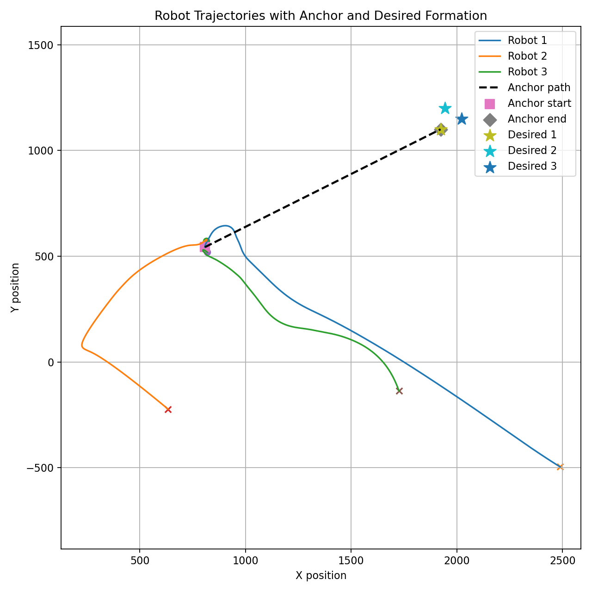
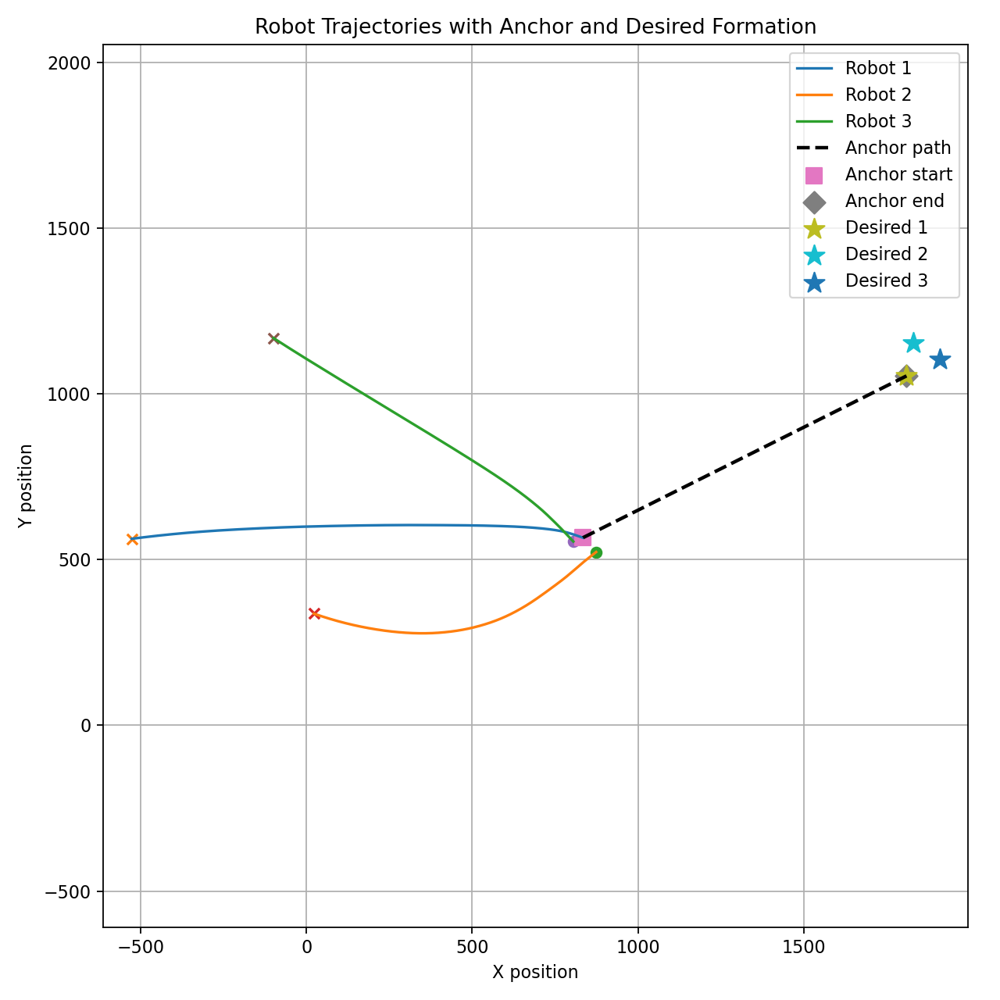
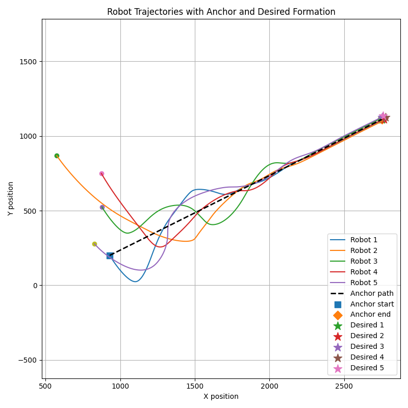
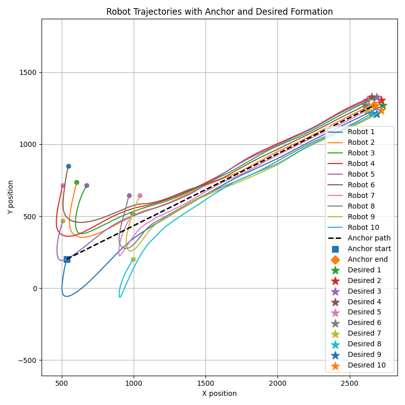
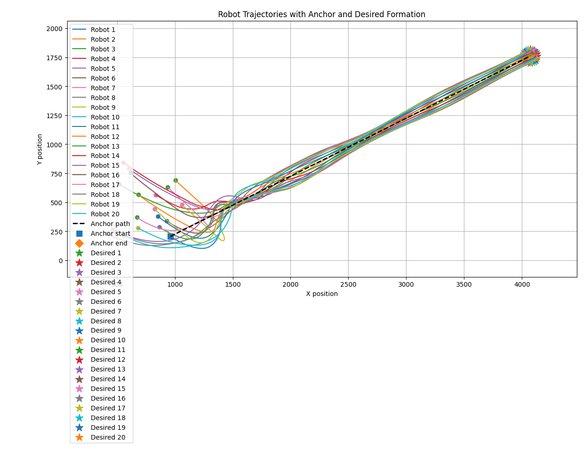

# Reinforcement Learning for Scalable Multi-Robot Formation Control

This project investigates reinforcement learning for multi-robot formation control by combining model-free RL with a structured graph-based formation controller.

Rather than asking the RL policy to directly output every robot's acceleration, the current approach preserves the consensus-control structure and uses Soft Actor-Critic (SAC) to adapt only two shared controller gains.

The current architecture has been evaluated in simulation with teams ranging from small formations up to **20 robots**.

## Demo Video

Original project demo:

https://youtu.be/FptJdGw1jp8

> The current structured gain-learning and large-team experiments extend beyond the version shown in the original demo.

---

## Project Overview

Each robot is modeled as a 2D double-integrator system:

```text
q_i = [x_i, vx_i, y_i, vy_i]
u_i = [u_xi, u_yi]
```

Each robot follows a desired state defined by a moving formation anchor and a robot-specific formation offset:

```text
q_i* = [
    anchor_x + offset_xi,
    desired_vx,
    anchor_y + offset_yi,
    desired_vy
]
```

The robots must maintain their desired relative formation while tracking a moving reference.

---

## Motivation

A classical consensus-style formation controller can be written as:

```text
rho = (L ⊗ I)(q - q*)
u = Γ rho
```

where:

- `q` is the stacked robot state
- `q*` is the stacked desired state
- `L` is the normalized graph Laplacian
- `rho` is the graph-based relative formation error
- `Γ` is the controller gain matrix

The first stage of this project tested direct end-to-end RL:

```text
u = π(obs)
```

In this setup, the policy must learn both inter-agent coordination and low-level control.

The second stage instead preserves the structured controller and lets RL adapt only a small set of controller gains.

---

## Phase 1: Direct-Action RL

The following direct-action algorithms were tested:

- SAC
- PPO
- DDPG

For a three-robot system, the policy directly outputs:

```text
action = [
    u_x1, u_y1,
    u_x2, u_y2,
    u_x3, u_y3
]
```

The learned action dimension therefore grows with the number of robots.

### Reward Design

The reward penalizes formation error, tracking error, and control effort:

```python
reward = (
    -w1 * formation_error**2
    -w2 * tracking_error**2
    -w3 * control_effort**2
)
```

Core metrics include:

```text
formation_error = ||(L ⊗ I)(q - q*)||
tracking_error  = ||q - q*||
control_effort  = ||u||
```

### Findings

Direct-action RL could produce partial formation behavior, but training was sensitive and difficult to stabilize.

Observed behavior included:

- SAC learning temporary formation behavior but sometimes losing it over longer rollouts
- PPO producing conservative motion but weaker reference tracking
- DDPG producing strong partial coordination in some runs while individual robots could still diverge
- strong sensitivity to reward weights, initialization, checkpoints, and reference motion

These results motivated the structured gain-learning approach.

---

## Example Direct-Action Results

### SAC



### PPO



### DDPG


---

## Phase 2: Structured Gain Learning

The current approach preserves the graph-based formation controller and allows SAC to adapt only two shared gains.

For each robot, the gain matrix is parameterized as:

```text
Γ_i = [
    [-g1, -g2,   0,   0],
    [  0,   0, -g1, -g2]
]
```

where:

- `g1` controls position-related feedback
- `g2` controls velocity-related feedback

Instead of outputting all robot control actions, SAC outputs only:

```text
[g1, g2]
```

These gains are inserted into the structured controller:

```text
rho = (L ⊗ I)(q - q*)
u_consensus = Γ rho
```

A separate global tracking controller moves the center of the formation with the reference trajectory.

This reduces the learned action space from:

```text
2N robot control actions
```

to:

```text
2 adaptive gains
```

regardless of the number of robots.

---

## Variable-Size Robot Representation

To support larger teams, each robot is represented as a token containing normalized relative-state errors:

```text
robot_i = [
    position_error_x,
    velocity_error_x,
    position_error_y,
    velocity_error_y
]
```

The robot tokens are processed by a Transformer encoder:

```text
robot tokens
     ↓
linear embedding
     ↓
Transformer encoder
     ↓
masked mean pooling
     ↓
fixed-size latent representation
     ↓
SAC actor / critic
     ↓
[g1, g2]
```

Padding and masking allow the same architecture to process different numbers of active robots up to a configured maximum.

The current implementation supports up to **20 robot tokens**.

---

## Controller Architecture

```text
global robot-error observations
            ↓
       Transformer
            ↓
            SAC
            ↓
      shared g1, g2
            ↓
structured graph-based consensus controller
            ↓
      robot accelerations
```

The learned gain-selection policy is currently **centralized**, because the Transformer observes all active robot tokens.

The consensus-control execution itself remains graph structured through the Laplacian.

A useful description of the current architecture is:

> **Centralized adaptive gain selection with distributed graph-structured control execution.**

---

## Graph Laplacian

The controller uses the normalized graph Laplacian:

```text
L = I - D^-1 A
```

where:

- `A` is the adjacency matrix
- `D` is the degree matrix

For the current degree-2 ring topology:

```text
L[i, i]       = 1
L[i, i - 1]   = -0.5
L[i, i + 1]   = -0.5
```

with wrap-around connections between the first and last robots.

Correct implementation of the normalized Laplacian was important for scaling beyond the original small-team experiments.

---

## Scalability Experiments

The structured approach has been evaluated with:

```text
3 → 5 → 7 → 10 → 15 → 20 robots
```

The same general SAC + Transformer + structured-controller architecture was retained as the team size increased.

Stable formation behavior has been observed in evaluation rollouts with up to **20 robots**.

Larger teams also showed that longer rollout horizons can be necessary before convergence becomes clear.

---

## Example Direct-Action Results

### 5 bots formation



### 10 bots formation



### 20 bots formation



## 20-Robot Results

The 20-robot experiments demonstrate that the structured controller can achieve low formation and tracking errors while keeping the learned action dimension fixed at two.

Representative late-stage results include:

```text
formation error < 0.001
tracking error  ≈ 0.01 - 0.03
```

with small individual robot position errors.

Checkpoint performance was not monotonic:

```text
50k   → unstable / oscillatory
75k   → strong convergence
100k  → strong and relatively fast convergence
125k  → degraded behavior
150k  → more variable gain adaptation
175k  → strong convergence again
200k  → strong convergence
```

This suggests that continued SAC training can move the policy between different useful and less-useful regions of the controller-gain space.

These checkpoint results are empirical simulation observations and are not presented as a formal stability guarantee.

---

## Learned Gain Behavior

Different successful checkpoints converged to different gain regimes, for example:

```text
g1 ≈ 0.97, g2 ≈ 0.97
g1 ≈ 0.94, g2 ≈ 0.89
g1 ≈ 0.87, g2 ≈ 0.91
g1 ≈ 0.94, g2 ≈ 0.92
```

Multiple gain regions can therefore produce strong formation-control behavior.

Some degraded checkpoints instead show large switching between low-gain and high-gain regimes.

This suggests that the learned policy behaves more like an adaptive gain-selection mechanism than a search for one unique fixed gain pair.

---

## Key Findings

- Direct-action RL is difficult because the policy must learn both coordination and low-level control.
- Preserving a classical consensus structure reduces the dimensionality of the RL control problem.
- SAC can learn adaptive controller gains instead of directly controlling every robot.
- The learned action dimension remains fixed at two as team size increases.
- Transformer-based robot-token encoding provides a convenient representation for variable-size teams.
- Stable simulation rollouts have been demonstrated with up to 20 robots.
- SAC checkpoint performance is not monotonic with training duration.
- Multiple gain regimes can produce strong control behavior.
- Larger teams may require longer evaluation horizons before convergence becomes visible.

---

## Current Limitations

- The Transformer observes global robot information, so learned gain selection is centralized.
- A single shared pair of gains `[g1, g2]` is used for all robots.
- The robot dynamics are simplified double-integrator models.
- Most scalability experiments use a ring communication topology.
- Robustness to robot failures and communication loss has not yet been systematically evaluated.
- The learned policy does not currently provide a formal stability guarantee.
- More systematic multi-seed evaluation is still needed for stronger statistical claims.

---

## Future Work

- Transformer ablation
- comparison with simpler pooled or MLP-based encoders
- neighborhood-only gain selection
- decentralized per-robot gain prediction
- robot failure and communication-loss experiments
- different graph topologies
- disturbances and more complex reference trajectories
- systematic multi-seed evaluation
- convergence-time analysis as team size increases

---

## Project Structure

```text
RL-formation-control/
│
├── Formation_control_A.py
├── env.py
├── README.md
├── requirements.txt
│
├── models/
├── demo/
├── plots/
└── logs/
```

---

## Installation

Create and activate a Python environment:

```bash
conda create -n rl-formation python=3.12
conda activate rl-formation
```

Install dependencies:

```bash
pip install numpy pygame matplotlib pandas gymnasium stable-baselines3 torch
```

---

## Running the Simulation

Run the main simulation:

```bash
python Formation_control_A.py
```

Example SAC training:

```python
model.learn(total_timesteps=100000)
model.save("models/example_model")
```

Example model loading:

```python
model = SAC.load("models/example_model", env=myenv)
```

---

## Notes on Trained Models

Trained model checkpoints are not included in the repository because they can be large and frequently change.

Example `.gitignore` entries:

```gitignore
models/
*.zip
sac_formation_env/
ppo_formation_env/
DDPG_formation_env/
__pycache__/
*.pyc
```

---

## Current Status

- [x] Classical graph-based formation simulator
- [x] Gymnasium environment
- [x] SAC direct-action baseline
- [x] PPO direct-action baseline
- [x] DDPG direct-action baseline
- [x] Structured SAC gain-learning controller
- [x] Transformer robot-token encoder
- [x] Variable-team observation masking
- [x] Correct normalized graph Laplacian
- [x] Scaling experiments through 20 robots
- [ ] Systematic multi-seed benchmark
- [ ] Transformer ablation
- [ ] Decentralized gain-selection policy
- [ ] Fault-tolerance experiments

---

## Author

Zhenyu Jiang

---

## Use of AI Tools

AI tools, including ChatGPT, were used as research and development aids for brainstorming, debugging discussions, code review, technical explanations, and documentation.

The author implemented and executed the simulation and training pipeline, conducted the experiments, evaluated the resulting policies, and verified the reported results. AI-assisted suggestions were reviewed and tested before being incorporated into the project.
